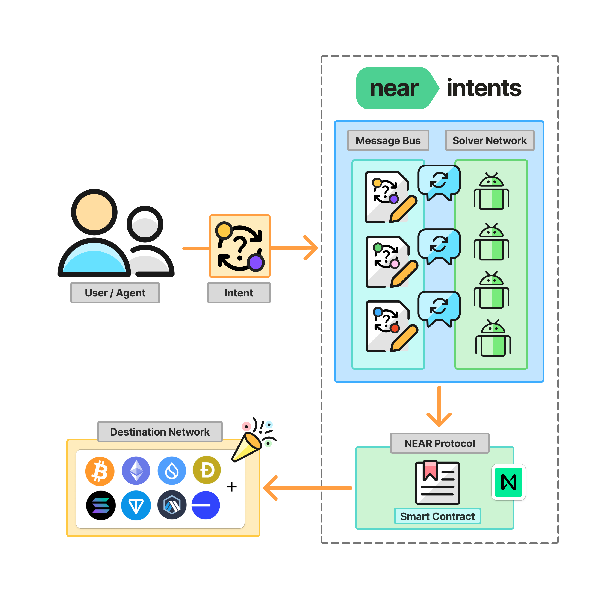

# NEAR Intents Documentation

---

# Contributing

We welcome contributions to improve our documentation! This site is powered by [GitBook](https://www.gitbook.com/) and synced with our GitHub repository.

## Quick Start

### Option 1: Edit Directly on the Site
The fastest way to contribute is through our documentation site:
1. Visit [docs.near-intents.org](https://docs.near-intents.org)
2. Navigate to the page you want to edit
3. Click **"Edit in GitHub"** 
4. Make your changes and submit a pull request

### Option 2: Local Development
For larger changes or multiple file edits:
1. Fork this repository
2. Create a new branch: `git checkout -b feature/your-improvement`
3. Make your changes
4. Commit with a clear message: `git commit -m "Add section on X"`
5. Push to your fork: `git push origin feature/your-improvement`
6. Open a pull request with a descriptive title and summary

## What We're Looking For

We appreciate contributions that:
- **Fix errors** - typos, broken links, outdated information
- **Improve clarity** - better explanations, examples, or code snippets
- **Add missing content** - new sections, FAQ answers, troubleshooting guides
- **Enhance organization** - better structure, navigation, or categorization

## Writing Guidelines

- **Use clear, concise language** - write for developers of all experience levels
- **Include code examples** where helpful, with proper syntax highlighting
- **Follow existing formatting** - maintain consistency with the current style
- **Test all links and code** before submitting   

## Pull Request Process

1. **Use a descriptive title** - "Fix typo in API docs" rather than "Update docs"
2. **Provide context** - explain what you changed and why
3. **Reference issues** - mention any related GitHub issues
4. **Keep changes focused** - one topic per PR when possible

## Questions or Need Help?

- [Join our community Telegram Support](https://t.me/near_intents)
- [Open an issue](https://github.com/defuse-protocol/docs/issues) for discussion before making large changes