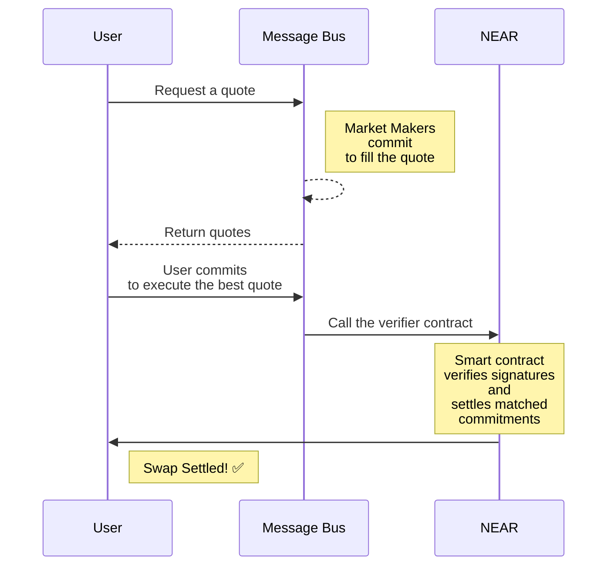

# Overview


The NEAR intents protocol and the documentation are under active development.

The protocol has been renamed from Defuse to "NEAR Intents".&#x20;


## Terminology

1. Entities:
   1. Distribution channels. Applications that have the users, who are interested in decentralised spot trading.
   2. Market Makers. Active market participants that deposit liquidity in order to fill quotes issued by users
2. Intent Settlement:
   1. [Message Bus.](market-makers/bus/) an off chain message bus used for sending quotes and signed intents (commitments) between market makers and users. Each distribution channel can run their own Message Bus with their own set of market makers.
   2. [Verifier](market-makers/verifier/). Smart contract that verifies intents expressed as state changes (“diffs”) signed by corresponding owners. The combination of state changes is committed as long as the invariant (total delta is zero) was kept for each token after these changes were applied. Deployed on NEAR mainnet.
   3. [1 Click](integration/distribution-channels/1click-api.md). Swapping agent that makes it easy for distribution channels to use NEAR intents.

