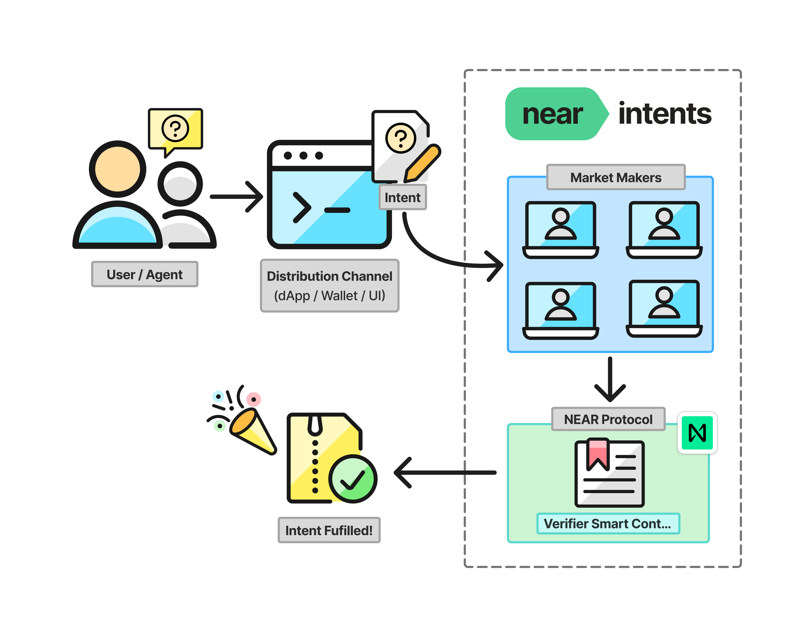
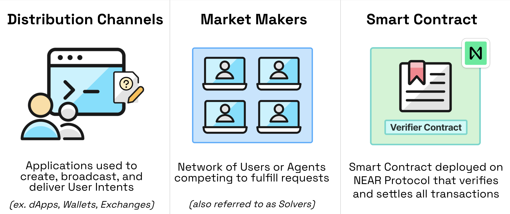

# Intents Overview

<figure>
  
  <figcaption></figcaption>
</figure>

 👉 **[Get API Key on the Partners Portal](https://partners.near-intents.org)**  



NEAR Intents and its documentation are under active development and have recently been renamed from "Defuse" to "NEAR Intents".

While the documentation and examples here focus on multichain token swaps, NEAR Intents extend far beyond these types of requests. Whether you want to swap tokens across chains or buy a pizza with Bitcoin, NEAR Intents serves as a protocol for ANY request where diverse solution marketplaces can naturally emerge through competitive discovery.

Read more about it in this [NEAR Intents Deep Dive blogpost](https://www.near.org/blog/unpacking-near-intents-a-deep-dive).


## NEAR Intents Components

<figure>
  
  <figcaption></figcaption>
</figure>

There are three core components of NEAR Intents:

| Name | Description |
|-----------|-------------|
| [Distribution Channels](./integration/distribution-channels/README.md) | Applications used for creating, broadcasting, and executing user Intents. (ex. Apps, Wallets, Exchanges)|
| [Market Makers](./market-makers/README.md) | Users or Agents that provide liquidity and compete to fulfill "Intent Requests". |
| [Verifier Smart Contract](./market-makers/verifier/README.md) | A smart contract deployed on NEAR Protocol that verifies and settles all transactions. |
