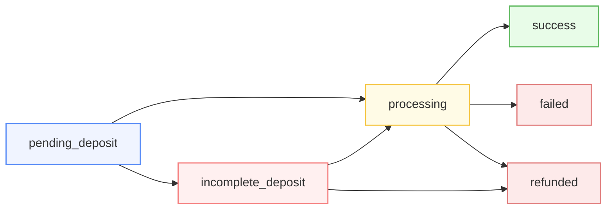

# 1Click API


While API keys are not currently required, we encourage you to obtain one to access higher rate limits and help us maintain observability. You can apply for access [here](https://docs.google.com/forms/d/1VYMcitAY3CWQuLhLISAPdirKAN27JxUl8RHDqvE1N-U/viewform?ts=6827a83d&edit_requested=true).


The purpose of 1Click is to make it easy to use NEAR Intents by temporarily transferring assets to the custody of a trusted swapping agent:

* Request a quote using **Get Quote** endpoint:\
  The response will contain a deposit address, unique for each quote
* Transfer tokens to the deposit address:\
  Once transferred, 1Click will start the swapping process automatically.
* **Submit Deposit Tx** using deposit transaction hash:\
  This step is optional, but it can help speeding up the process.
* **Get Execution Status** at any time to see the progress.

The swap will either succeed or fail; in case of a failure, the funds will end up on the refund address and a new attempt to swap would need to be triggered by repeating this flow.

## API Specification (v0)

The [OpenAPI spec](https://1click.chaindefuser.com/docs/v0/openapi.yaml) is made available to auto-generate clients. Client SDKs for [TypeScript](https://github.com/defuse-protocol/one-click-sdk-typescript), [Go](https://github.com/defuse-protocol/one-click-sdk-go) and [Rust](https://github.com/defuse-protocol/one-click-sdk-rs) are already available on GitHub.

In order to use the API you need to [obtain a JWT token](https://docs.google.com/forms/d/e/1FAIpQLSdrSrqSkKOMb_a8XhwF0f7N5xZ0Y5CYgyzxiAuoC2g4a2N68g/viewform?usp=header). It is possible to use the API without a JWT  but it's required to set it up for production workloads to ensure higher quality of service and to avoid being rate limited.


[https://1click.chaindefuser.com/docs/v0/openapi.yaml?2025-03-31](https://1click.chaindefuser.com/docs/v0/openapi.yaml?2025-03-31)



[https://1click.chaindefuser.com/docs/v0/openapi.yaml?2025-03-31](https://1click.chaindefuser.com/docs/v0/openapi.yaml?2025-03-31)



[https://1click.chaindefuser.com/docs/v0/openapi.yaml?2025-03-31](https://1click.chaindefuser.com/docs/v0/openapi.yaml?2025-03-31)



[https://1click.chaindefuser.com/docs/v0/openapi.yaml?2025-03-31](https://1click.chaindefuser.com/docs/v0/openapi.yaml?2025-03-31)

