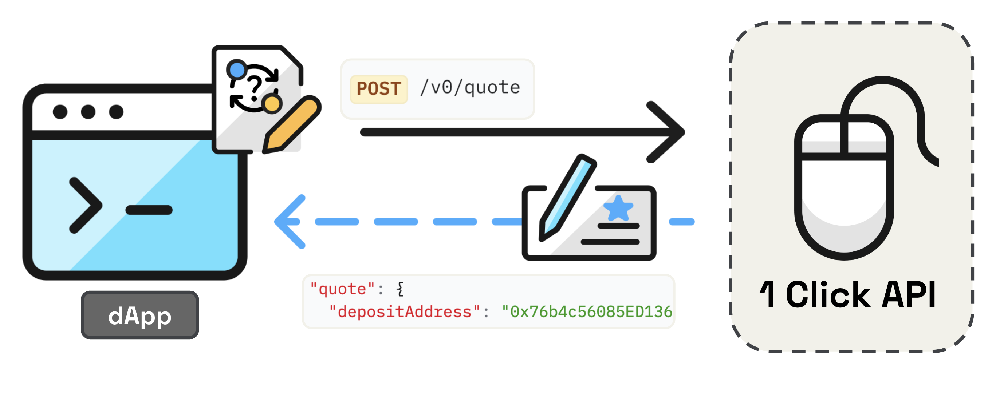

# 1Click Swap API

## What is 1Click Swap API?

1Click simplifies NEAR Intents by temporarily transferring assets to a trusted swapping agent that coordinates with [Market Makers](../../market-makers/README.md) to execute your intent. This REST API abstracts away the complexity of intent creation, solver coordination, and transaction execution, letting you focus on your user experience.

It features:

- Simple REST endpoints for intent creation and management
- Automatic solver discovery and competitive pricing
- Built-in transaction handling and status tracking
- Support for cross-chain intents

## How 1Click API Works

<figure>
  
  <figcaption></figcaption>
</figure>

1. **Request a quote** - Send the user's intent request to 1Click's [`Request Quote`](#post-v0-quote) endpoint
   - Receive the best available quote with a unique deposit address
2. **Transfer tokens** - If provided quote is satisfactory, deposit tokens to the unique address provided
   - 1Click automatically begins the swapping process upon receipt
3. **Submit deposit transaction** - (optional)
   - Use the [`Submit Deposit Tx`](#post-v0-deposit-submit) endpoint with your transaction hash to speed up processing
4. **Monitor progress** - (optional)
   - You can query the process at any time with the [`Get Execution Status`](#get-v0-status) endpoint

**Result:** The swap either succeeds with tokens delivered to your specified address, or fails with funds automatically refunded to your refund address. Failed swaps can be retried by repeating this flow.


Centralized exchanges (CEXes) often use intermediate or per-user deposit addresses. These may not credit deposits sent via NEAR Intents until they are recognized or whitelisted. We recommend sending a small test amount before attempting full-scale transfers.


## API Specification (v0)

Auto-generate clients using our [OpenAPI spec](https://1click.chaindefuser.com/docs/v0/openapi.yaml).


Authentication: While testing can be done without authentication, we recommend [obtaining a JWT token](https://docs.google.com/forms/d/e/1FAIpQLSdrSrqSkKOMb_a8XhwF0f7N5xZ0Y5CYgyzxiAuoC2g4a2N68g/viewform?usp=header) for higher rate limits, reliable service, and to help us maintain service quality.


### SDKs

Pre-built SDKs for popular languages:

- [TypeScript SDK](https://github.com/defuse-protocol/one-click-sdk-typescript)
- [Go SDK](https://github.com/defuse-protocol/one-click-sdk-go)
- [Rust SDK](https://github.com/defuse-protocol/one-click-sdk-rs)

### API Endpoints

**Base URL:** https://1click.chaindefuser.com/

| Name                 | Route         | Description                                         |
|----------------------|--------------|-----------------------------------------------------|
| [Get supported tokens](#get-v0-tokens) | /v0/tokens  | Retrieves list of tokens currently supported by 1Click |
| [Request a swap quote](#post-v0-quote) | /v0/quote | Generates a swap quote based on input parameters (Intent) | 
| [Submit deposit tx hash](#post-v0-deposit-submit) | /v0/deposit/submit | Optional route to speed up process with early deposit notification to 1Click |
| [Check swap status](#get-v0-status) | /v0/status | Gets current status of a swap using unique deposit address |


[https://1click.chaindefuser.com/docs/v0/openapi.yaml?2025-03-31](https://1click.chaindefuser.com/docs/v0/openapi.yaml?2025-03-31)



[https://1click.chaindefuser.com/docs/v0/openapi.yaml?2025-03-31](https://1click.chaindefuser.com/docs/v0/openapi.yaml?2025-03-31)



[https://1click.chaindefuser.com/docs/v0/openapi.yaml?2025-03-31](https://1click.chaindefuser.com/docs/v0/openapi.yaml?2025-03-31)



[https://1click.chaindefuser.com/docs/v0/openapi.yaml?2025-03-31](https://1click.chaindefuser.com/docs/v0/openapi.yaml?2025-03-31)

