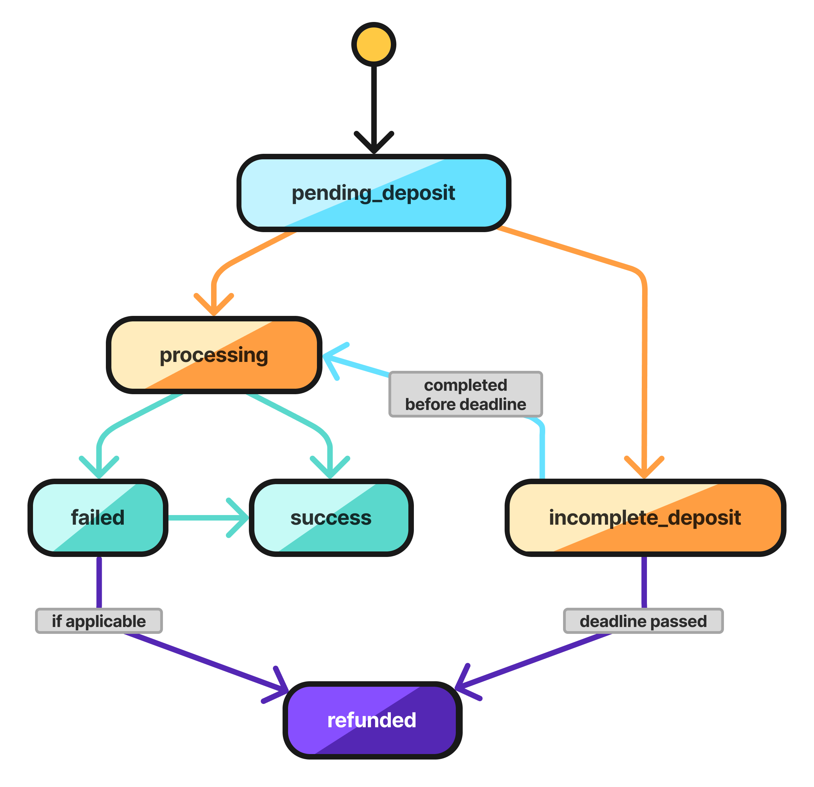

# 1Click API

## What is 1Click Swap API?

1Click simplifies NEAR Intents by temporarily transferring assets to a trusted swapping agent that coordinates with [Market Makers](../../market-makers/) to execute your intent. This REST API abstracts away the complexity of intent creation, solver coordination, and transaction execution, letting you focus on your user experience.

It features:

* Simple REST endpoints for intent creation and management
* Automatic solver discovery and competitive pricing
* Built-in transaction handling and status tracking
* Support for cross-chain intents

## How 1Click API Works

<figure><figcaption></figcaption></figure>

1. **Request a quote** - Send the user's intent request to 1Click's [`Request Quote`](1click-api.md#post-v0-quote) endpoint
   * Receive the best available quote with a unique deposit address
2. **Transfer tokens** - If provided quote is satisfactory, deposit tokens to the unique address provided
   * 1Click automatically begins the swapping process upon receipt
3. **Submit deposit transaction** - (optional)
   * Use the [`Submit Deposit Tx`](1click-api.md#post-v0-deposit-submit) endpoint with your transaction hash to speed up processing
4. **Monitor progress** - (optional)
   * You can query the process at any time with the [`Get Execution Status`](1click-api.md#get-v0-status) endpoint

**Result:** The swap either succeeds with tokens delivered to your specified address, or fails with funds automatically refunded to your refund address. Failed swaps can be retried by repeating this flow.


Centralized exchanges (CEXes) often use intermediate or per-user deposit addresses. These may not credit deposits sent via NEAR Intents until they are recognized or whitelisted. We recommend sending a small test amount before attempting full-scale transfers.


## Quickstart 1Click Tutorial

To quickly get started with 1Click API, see this example breaking down each of the above steps:

* [github.com/near-examples/near-intents-examples](https://github.com/near-examples/near-intents-examples)

This repo will show you how to quickly get started performing cross-chain swaps using 1Click's TypeScript SDK.

## API Specification (v0)

Auto-generate clients using our [OpenAPI spec](https://1click.chaindefuser.com/docs/v0/openapi.yaml).


Authentication: Please [obtain a JWT token](https://docs.google.com/forms/d/e/1FAIpQLSdrSrqSkKOMb_a8XhwF0f7N5xZ0Y5CYgyzxiAuoC2g4a2N68g/viewform?usp=header) to avoid 0.1% (10 basis points) fee while using 1Click Swap API.


### SDKs

Pre-built SDKs for popular languages:

* [TypeScript SDK](https://github.com/defuse-protocol/one-click-sdk-typescript)
* [Go SDK](https://github.com/defuse-protocol/one-click-sdk-go)
* [Rust SDK](https://github.com/defuse-protocol/one-click-sdk-rs)

### Swap Statuses

1Click Swap goes through these states in its lifecycle:

* PENDING\_DEPOSIT — Awaiting the deposit to the deposit address.
* PROCESSING — Once the deposit on deposit address is detected, information is processed and executed by Market Makers.
* SUCCESS — Funds are delivered to the specified destination chain/address.
* INCOMPLETE\_DEPOSIT — Deposit is received but below required bridge or quoted amount.
* REFUNDED — If the swap is not completed, funds are automatically returned to the refund address.
* FAILED - Swap failed due to the error.

<figure><figcaption></figcaption></figure>

### API Endpoints

**Base URL:** https://1click.chaindefuser.com/

| Name                                                           | Route              | Description                                                                  |
| -------------------------------------------------------------- | ------------------ | ---------------------------------------------------------------------------- |
| [Get supported tokens](1click-api.md#get-v0-tokens)            | /v0/tokens         | Retrieves list of tokens currently supported by 1Click                       |
| [Request a swap quote](1click-api.md#post-v0-quote)            | /v0/quote          | Generates a swap quote based on input parameters (Intent)                    |
| [Submit deposit tx hash](1click-api.md#post-v0-deposit-submit) | /v0/deposit/submit | Optional route to speed up process with early deposit notification to 1Click |
| [Check swap status](1click-api.md#get-v0-status)               | /v0/status         | Gets current status of a swap using unique deposit address                   |


Use `dry: true` to display the quote price without generating a transaction. Set `dry: false` only at confirmation to reduce system load.



The `amountOutUsd` field in quote responses should **NOT** be used in business logic or calculations. It is provided for display purposes only. Always use the actual token amounts for any programmatic operations.



[https://1click.chaindefuser.com/docs/v0/openapi.yaml?2025-03-31](https://1click.chaindefuser.com/docs/v0/openapi.yaml?2025-03-31)



[https://1click.chaindefuser.com/docs/v0/openapi.yaml?2025-03-31](https://1click.chaindefuser.com/docs/v0/openapi.yaml?2025-03-31)



[https://1click.chaindefuser.com/docs/v0/openapi.yaml?2025-03-31](https://1click.chaindefuser.com/docs/v0/openapi.yaml?2025-03-31)



[https://1click.chaindefuser.com/docs/v0/openapi.yaml?2025-03-31](https://1click.chaindefuser.com/docs/v0/openapi.yaml?2025-03-31)



[OpenAPI test](https://1click.chaindefuser.com/docs/v0/openapi.yaml)

