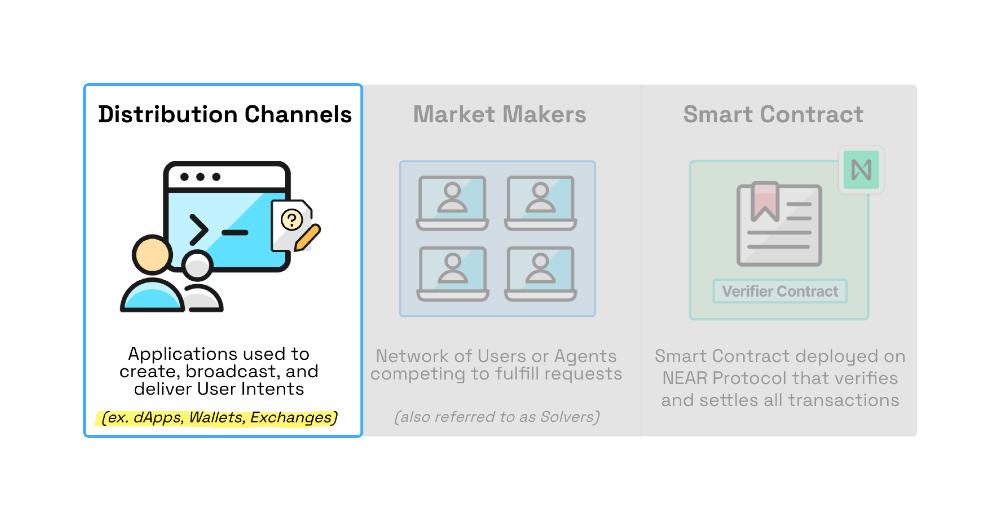

# Distribution Channels

<figure>
    
    <figcaption></figcaption>
</figure>

## What are Distribution Channels?

Distribution Channels are the user-facing applications, wallets, and exchanges that make NEAR Intents accessible to end users. They handle intent creation, management, and asset delivery, while [Market Makers](../../market-makers/README.md) handle the actual fulfillment and pricing.

## Create a Distribution Channel

The fastest way to integrate NEAR Intents into your application is through the [1Click Swap API](1click-api.md). This REST API abstracts away the complexity of intent creation, solver coordination, and transaction execution, letting you focus on your user experience.

Perfect for: Wallets, dApps, and exchanges wanting to offer intent-based transactions without building infrastructure from scratch.

[Get started with 1Click API →](1click-api.md)
