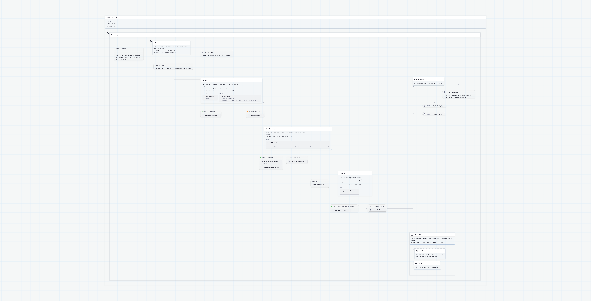
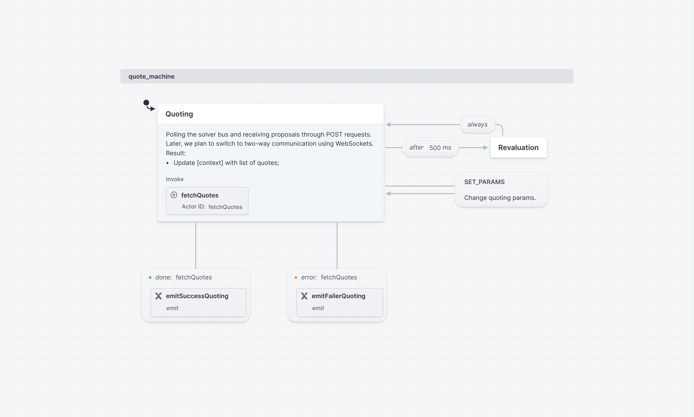

# SDK

### High Level Architecture

The Defuse Protocol SDK is built on two core components that work together to provide a robust and flexible solution for cross-chain asset swaps:

#### 1. State Machines (XState)

Our swap logic is driven by two core state machines, implemented using XState:

* **Quote Machine**: Handles the process of obtaining and managing swap quotes.
* **Swap Machine**: Manages the entire swap process from initiation to completion.

These state machines are framework-agnostic and can be used on both client and server sides. They provide a clear and predictable flow for complex cross-chain swap operations, handling various states, transitions, and edge cases.

Key benefits of using state machines:

* Clear visualization of the swap process
* Easier management of complex logic and edge cases
* Improved testability and maintainability
* Framework-agnostic implementation

#### Swap machine chart



<figure><figcaption><p>Swap machine</p></figcaption></figure>

#### Quote machine chart



<figure><figcaption><p>Quote machine</p></figcaption></figure>

#### 2. Defuse SDK

The Defuse SDK wraps the state machine logic and provides a complete solution as React components and hooks. This layer abstracts the complexity of state management and provides a user-friendly interface for developers to integrate swap functionality into their applications.

Key features of the Defuse SDK:

* **React Components**: Ready-to-use components like `SwapWidget` that encapsulate the entire swap interface.
* **Context Provider**: `SwapWidgetProvider` that manages the global state and provides necessary context to child components.
* **Hooks**: Custom hooks that allow developers to interact with the swap logic programmatically.
* **Theming**: Built-in theming support for easy customization.

#### Architecture Diagram

```
+-------------------+
|    Application    |
+-------------------+
          |
          v
+-------------------+
|    Defuse SDK     |
| (React Components |
|     and Hooks)    |
+-------------------+
          |
          v
+-------------------+
|   State Machines  |
| (Quote & Swap)    |
+-------------------+
          |
          v
+-------------------+
| Blockchain/Web3   |
|    Interactions   |
+-------------------+
```

This architecture allows for a separation of concerns, where the core swap logic is handled by the state machines, while the SDK provides an easy-to-use interface for React applications. Developers can leverage the power of state machines for complex logic handling while enjoying the simplicity of React components for UI integration.

#### Use Defuse SDK

Install the package:

```
yarn add @defuse-protocol/defuse-sdk
```

Now that you’ve installed the SDK, you can use it in your application:

```javascript
"use client"
import { SwapWidgetProvider, SwapWidget } from "@defuse-protocol/defuse-sdk"

export default function MyApp() {
  return (
    <div>
      <SwapWidgetProvider>
        <h1>Welcome to my app</h1>
        <SwapWidget
          theme="dark"
          tokenList={tokenList}
          event={eventListener}
          onSign={signMessage}
        />
      </SwapWidgetProvider>
    </div>
  )
}
```
