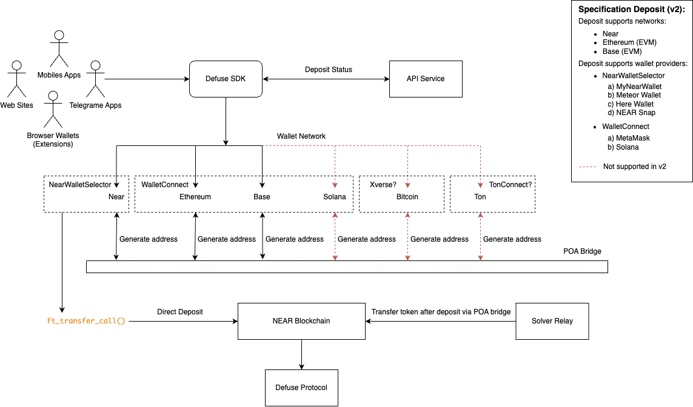

# Deposit

This page provides a detailed overview of the deposit process within the Defuse protocol. It outlines both desktop and mobile user flows, covering wallet connection, deposit address generation, and successful transaction confirmation, including QR code scanning for mobile users.

<figure><figcaption></figcaption></figure>
