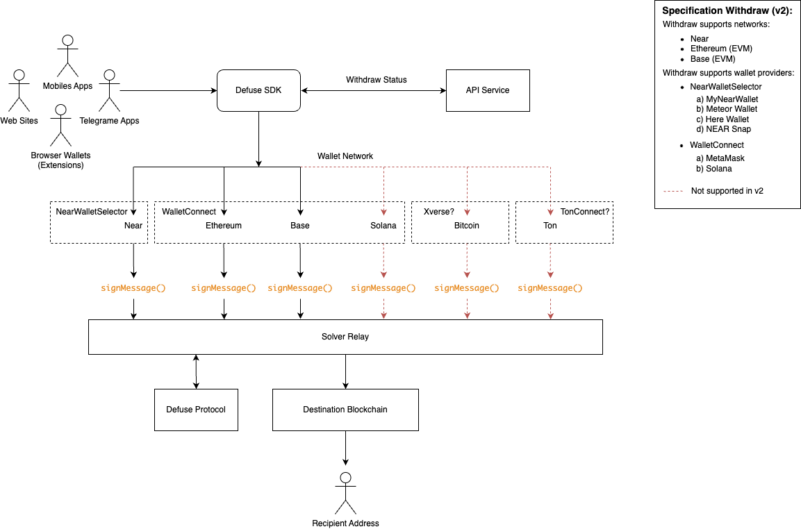

# Withdraw

This page outlines the withdrawal process within the Defuse protocol, detailing the steps for connecting wallets, selecting tokens, and handling multichain assets. It includes a visual chart to simplify the user flow for both desktop and mobile interactions.

<figure><figcaption></figcaption></figure>
