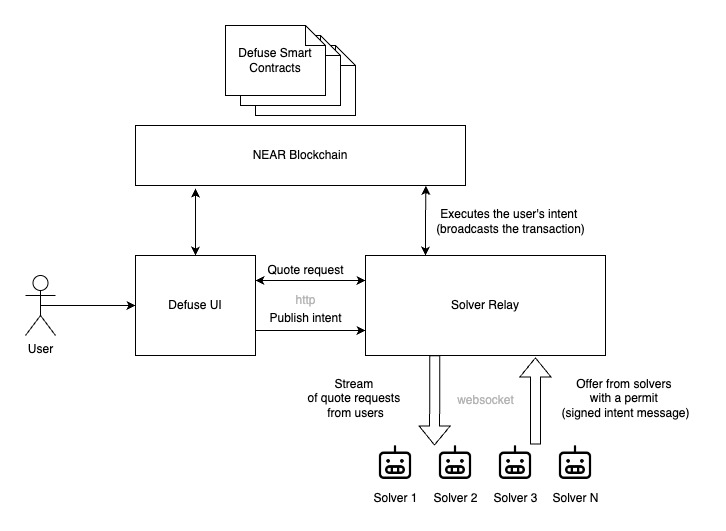

# Message Bus

Message Bus is an additional system component that optimizes frontends←→market makers' quoting, and quote discovery process. Any frontend app may use a generic foundation-hosted Solver Bus or launch its own instance to customize preferred solver accounts.

Near Intents protocol may operate without a Message Bus component:

* frontends may use any other quoting mechanisms to compose an intent for the end user
* solvers may index Near blockchain to find intents to fill.

However, using Solver Bus is recommended for speed optimization goals.

On the diagram "Message Bus" is called "Solver Relay" and "Verifier" is part of Defuse Smart contracts :)

<figure><figcaption></figcaption></figure>
